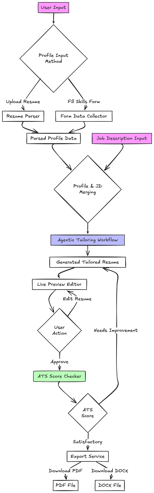

# resume-tailor-ai

[](https://hacktoberfest.com/)

An AI-powered resume tailoring application built with FastAPI and modern Python tooling.

This project is open to contributions for Hacktoberfest!

## Flow



## Contributing

## 🚀 Quick Start

This project uses [UV](https://github.com/astral-sh/uv) as the package manager for fast dependency resolution and virtual environment management.

### Prerequisites

- Python 3.9+ (UV will manage Python versions automatically)
- [UV package manager](https://github.com/astral-sh/uv#installation)

### Installation

1. **Install UV** (if not already installed):
   ```bash
   # On macOS and Linux
   curl -LsSf https://astral.sh/uv/install.sh | sh

   # On Windows
   powershell -c "irm https://astral.sh/uv/install.ps1 | iex"

   # Using pip
   pip install uv
   ```

2. **Clone and set up the project**:
   ```bash
   git clone <repository-url>
   cd resume-tailor-ai

   # Install dependencies (creates virtual environment automatically)
   uv sync
   ```

### 🏃‍♂️ Running the Application

#### Option 1: Using UV directly
```bash
# Run the development server with hot reload
uv run uvicorn app.main:app --host 127.0.0.1 --port 8000 --reload
```

#### Option 2: Using Make commands
```bash
# Run development server
make run

# Or use the custom script
make run-script
```

#### Option 3: Using the development script
```bash
uv run python scripts/dev.py
```

### 🛠️ Development Commands

```bash
# Install all dependencies including development tools
make dev

# Run tests
make test

# Code formatting
make format

# Linting
make lint

# Clean up cache and build artifacts
make clean
```

### 📡 API Endpoints

Once running, you can access:

- **Application**: http://127.0.0.1:8000/
- **API Documentation**: http://127.0.0.1:8000/docs
- **ReDoc Documentation**: http://127.0.0.1:8000/redoc

### 🏗️ Project Structure

```
resume-tailor-ai/
├── app/                    # FastAPI application
│   ├── __init__.py
│   └── main.py            # Main application entry point
├── scripts/               # Development scripts
│   └── dev.py            # Development server runner
├── pyproject.toml        # Project configuration and dependencies
├── uv.toml              # UV-specific configuration
├── Makefile             # Common development commands
└── README.md

We welcome contributions to resume-tailor-ai! Please see our [CONTRIBUTING.md](CONTRIBUTING.md) for more information on how to get started.

## Code of Conduct

Everyone participating in this project is expected to abide by our [Code of Conduct](CODE_OF_CONDUCT.md). Please read it before contributing.

## License

This project is licensed under the MIT License. See the [LICENSE](LICENSE) file for details.